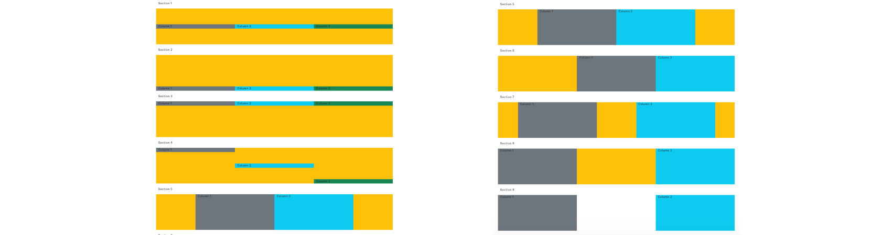
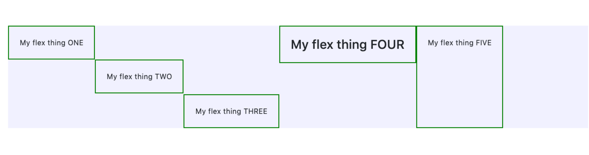
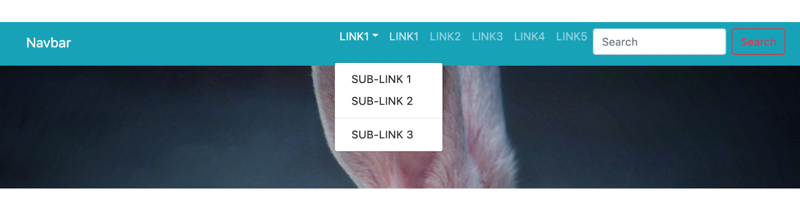

// README is in progress

# Bootstrap fundamentals
> Project from online course to help learn bootstrap

## Table of contents
* [General info](#general-info)
* [Graphics](#graphics)
* [Technologies](#technologies)
* [Setup](#setup)
* [Features](#features)
* [Status](#status)
* [Inspiration](#inspiration)
* [Contact](#contact)

## General info
The purpose of the project is to lay the foundations how bootstrap works.
The name of the online course is "Bootstrap 4 for the Developer" from Mario Duilio Macari, wihch can be found in pluralsight.
The content in this project is divided in sections, and every section is in different html file.
* Bg colors
* Containers and rows
* Media breakpoints
* Grid system
* Aligments and offsets
* Padding display and margins
* Flexbox / Flexible box
* Precoded navbar start, navbar colors
* Search box in navbar

## Graphics
* 4 Principles of graphic design

* All bootstrap color names

* Containers and rows

* Media breakpoints

* Grid system

* Aligment and offsets

* Padding, display and margins

* Flexbox

* Navbars

## Technologies
* Bootstrap from 4.1.1 to 5.0.0

## Setup
// Describe how to install / setup your local environement / add link to demo version.
* Begin with the Starter template from https://getbootstrap.com/docs/5.0/getting-started/introduction/
* Emmet extention https://emmet.io/ for easier coding
* Live Server https://marketplace.visualstudio.com/items?itemName=ritwickdey.LiveServer extention for live local reload on the code 

## Code Examples
Show examples of usage:
`put-your-code-here`

## Features
List of features ready and TODOs for future development
* Awesome feature 1
* Awesome feature 2
* Awesome feature 3

To-do list:
* Wow improvement to be done 1
* Wow improvement to be done 2

## Status
Project is: _in progress_

## Inspiration
Add here credits. Project inspired by..., based on...

## Contact
Created by [@Lilyah](https://github.com/Lilyah) - feel free to contact me!